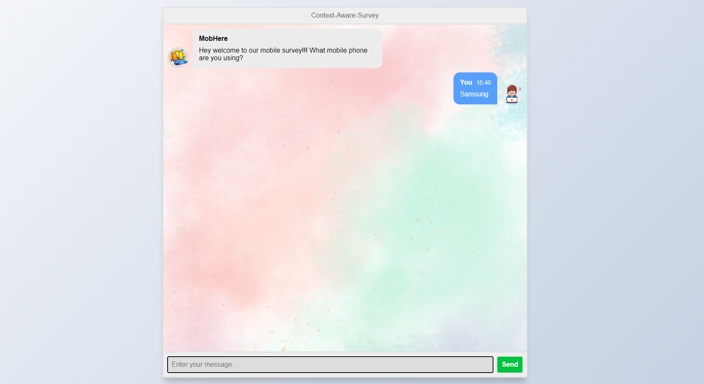

# Survey

A User-Based Customized Survey Chatbot

This project is a web-based application that uses a chatbot to conduct surveys based on user reviews. The project aims to provide a personalized way to collect feedback and opinions from the users.

<center>
    
</center>

# Tech-Stack

- Python
- Flask
- HTML
- CSS
- MySQL

## Features

- The application allows the user to enter a phone name that they want to review.
- The application allows the user to write a short review of the phone, highlighting its pros and cons, likes and dislikes, etc.
- The application uses the ChatGPT API to analyze the user review and generate relevant and follow-up questions for the user.
- The application uses natural language processing (NLP) techniques, such as tokenization, lemmatization, stopword removal, etc., to preprocess the user review and extract the keywords and topics.
- The application also uses a predefined list of questions.
- The application engages the user in a conversational survey, asking them questions about their experience, preferences, suggestions, etc.
- The application stores the user responses and the survey results in a MySQL database.

## Installation and Usage

To install and run this project, you need to have Python 3 installed on your computer. You also need to install and import the following Python libraries:

- flask
- render_template
- request
- numpy
- pandas
- nltk
- mysql.connector

You can use any IDE or editor of your choice.

To download the code and data files for this project, you can clone this GitHub repository using the following command:

```https://github.com/Amritha-07/Survey.git```

To execute the code, you can run the following command:

`python app.py`

or 

```python app.py```

You will see the output of the web application on your console or terminal.

To access the web application from your web browser, you can enter the URL of your local host followed by the port number (such as `http://127.0.0.1:5000/`).

You will see the home page of the web chatbot with an option to enter a phone name and a phone category. You can type any valid input (such as "phone" or "electronics") and click on Search.

## References

This project dataset was from the following sources:

-[ Amazon Cell Phones Reviews Datasets](https://www.kaggle.com/datasets/datafiniti/consumer-reviews-of-amazon-products/data) from kaggle
